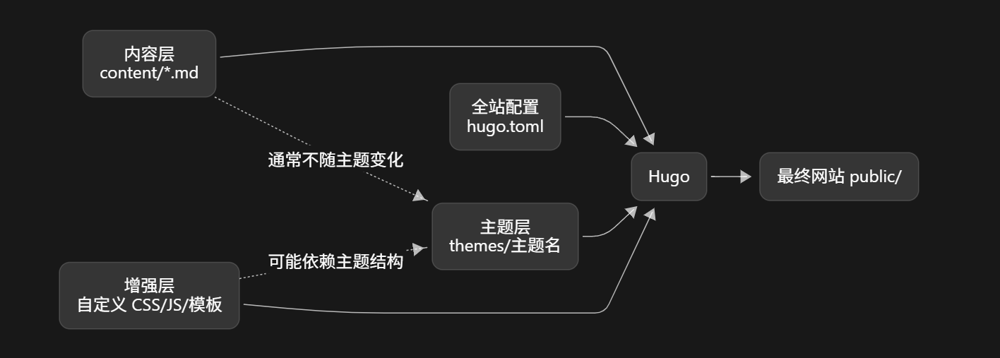

+++
date = '2026-09-02T20:38:51+08:00'
draft = false
title = '这个Blog搭建历程及我学习到东西'
+++

## 框架的搭建

### Hugo的使用

```powershell
winget install Hugo.Hugo.Extended
```

直接在cmd输入，安装hugo

在文件夹下打开命令行输入

`hugo new site my-blog`创建框架

#### 各文件夹的用处

```text
content     写什么
assets       加工哪些资源
static       原样提供哪些文件
data         提供哪些结构化数据
i18n         如何翻译
layouts      如何生成 HTML
hugo.toml    全站怎样配置
resources    Hugo 的加工缓存
public       最终构建结果
```

#### Hugo工作原理

[](blog-workflow.svg)

[](separate.png)

## Git使用

### 一

Stack 主题本身是一个独立 Git 仓库，远程地址是 CaiJimmy/hugo-theme-stack。

如果现在直接在 my-blog 初始化并添加文件，会产生“嵌套 Git 仓库”问题。

powershell运行下面代码把主题自己的 Git 元数据移到项目外备份。主题源码不会移动

```powershell
Move-Item -LiteralPath 'D:\Blog\my-blog\themes\hugo-theme-stack\.git' -Destination 'D:\Blog\hugo-theme-stack-git-metadata-backup'
```

不使用子模块，而是把 Stack 主题源码完整纳入博客仓库。这样即使主题仓库以后消失，博客仓库仍然是完整的。

### 二

创建 `.gitignore`，告诉 Git 哪些文件忽略。(.gitignore 通常只忽略尚未被 Git 跟踪的文件；已经提交过的文件不会因为后来加入 .gitignore 就自动停止跟踪。)比如下面这些

- `/public/`：Hugo 生成的网站，可随时重新构建，不放进源码仓库。
- `/resources/_gen/`：SCSS 等资源的构建缓存。
- `/.hugo_build.lock`：运行 hugo server 时产生的锁文件。
- Thumbs.db、Desktop.ini：Windows 自动生成的文件。
- .vscode、.idea：编辑器的本地配置。

### 三

初始化博客的 Git 仓库。

输入`git init -b main` ：

- `git`      → 使用 Git
- `init`     → initialize，初始化
- `-b`       → branch，指定初始分支
- `main`     → 分支名字

执行之后，Git 会在`D:\Blog\my-blog\`里面创建一个隐藏的：`.git`

```text
D:\Blog\my-blog\
├─ .git\          ← Git 创建的，存放版本历史等
├─ .gitignore     ← 你创建的，告诉 Git 忽略什么
├─ content\
├─ themes\
├─ public\
└─ hugo.toml
```

#### 这是我的.git下的文件夹及文件

```text
.git/
├─ HEAD
├─ config
├─ description
├─ COMMIT_EDITMSG
├─ index
├─ hooks/
├─ info/
├─ logs/
├─ objects/
└─ refs/
```

##### 文件

| 文件 | 实际用途 |
|---|---|
| [HEAD](<D:\Blog\my-blog\.git\HEAD>) | 表示当前检出的分支。内容是 `ref: refs/heads/main`，即当前位于 `main` |
| [config](<D:\Blog\my-blog\.git\config>) | 这个仓库自己的配置，包括用户名、邮箱、GitHub 远程地址、`main` 跟踪 `origin/main` |
| `index` | 二进制暂存区。`git add` 修改的就是它，同时也缓存文件状态。不要手动打开、修改或删除 |
| `COMMIT_EDITMSG` | 保存上一次提交信息，目前是 `feat: add structured post archetype`，下次提交时会被覆盖 |
| `description` | 旧式 GitWeb 使用的仓库描述占位文件，对 GitHub 仓库介绍没有作用 |

##### `.git` 各文件夹的作用

```text
.git/
├─ hooks/      Git 操作前后自动运行的脚本
├─ info/       本地辅助配置，例如本地忽略规则
├─ logs/       记录分支和 HEAD 的移动历史
├─ objects/    保存提交、文件内容和目录结构
└─ refs/       保存分支、远程分支和标签指针
```

简单理解：

- `objects`：Git 保存的实际数据。
- `refs`：各个分支指向哪个提交。
- `logs`：分支和提交的变化记录。
- `hooks`：执行 Git 操作时可以触发的脚本。
- `info`：只在本地使用的辅助信息。

`.git` 由 Git 自动管理，不要手动修改或删除里面的文件。

## 问题及解决

### 最开始一直显示Page Not Found

#### 原因

```text
content       ✅
layouts       ❌
themes        ❌
```

只有内容，静态配置和主体没写（至少需要主题）


